# <div align="center">Festy Event</div>

<div align="center">
  <strong>Full-stack event booking and venue management platform for Tunisia — events, reservations with QR tickets, venues on an interactive map, invoicing, contracts, complaints, blog and admin analytics.</strong>
</div>

<br>

<div align="center">


</div>

<p align="center">
  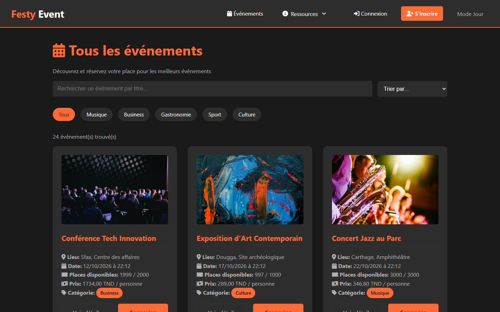
</p>

---

## 🚀 Overview

**Festy Event** is a Django web application for discovering, booking and operating events across Tunisia. Visitors browse a catalog of concerts, conferences, food and sports events; registered clients reserve seats and receive a **unique QR-code ticket** by email; administrators manage the whole lifecycle — events, venues and their availability calendars, invoices and payments, service contracts, user accounts, complaints and community recommendations — from a dedicated back-office with live analytics.

The project is built as a set of focused Django apps (one per business domain), server-rendered templates with a custom dark/light theme, and localized for Tunisia (`fr-fr`, `Africa/Tunis`, prices in **TND** with 3-decimal precision, 24 governorates on the map).

> Originally developed as a team/university project and republished here under my current GitHub account. Secrets were removed from the codebase and configuration is loaded from environment variables.

---

## ✨ Features

| Module | App | Key capabilities |
|---|---|---|
| **Events** | `events` | Public catalog with search, category filters and sorting; event detail pages; admin CRUD with confirmation step; live remaining-seat computation |
| **Reservations** | `reservations` | Seat booking with live price total, edit / cancel, unique reference (`RES-XXXX`), **QR-code ticket**, HTML confirmation email (resend supported) |
| **Dashboards** | `reservations` | Client dashboard (spend, seats, favorite category, 12-month history) and admin dashboard (revenue, occupancy, average basket, cancellation rate + Chart.js graphs) |
| **Users** | `users` | Registration, login with role-based redirect (client vs admin), profile edit, account deletion, admin user management (create / update / activate / delete) |
| **Venues & logistics** | `locations` | Venue catalog (indoor/outdoor, capacity, hourly/daily rates, amenities), **interactive Leaflet map of Tunisia by governorate**, per-venue monthly **availability calendar** with blocked dates |
| **Payments & invoices** | `payments` | Invoices auto-generated for confirmed reservations, client payment flow, admin supervision of payments/invoices, **PDF invoice export** (WeasyPrint) with payment QR code and 19% VAT breakdown |
| **Contracts** | `contracts` | Service agreements with a draft → active → completed / cancelled lifecycle and **dual signature** (client + admin) |
| **Complaints** | `complaints` | Users file complaints with category & priority; admins filter, respond and track resolution |
| **Recommendations** | `events` | Users recommend events; admins approve, feature, respond or delete; "helpful" voting |
| **Content & support** | `blog`, `reviews` | Blog with categories, comments and newsletter; reviews, FAQ with helpful votes, contact form |
| **UI** | `templates`, `static` | Responsive layout, persistent **dark / light mode** toggle, Font Awesome icons, French UI |

---

## 🧠 Architecture

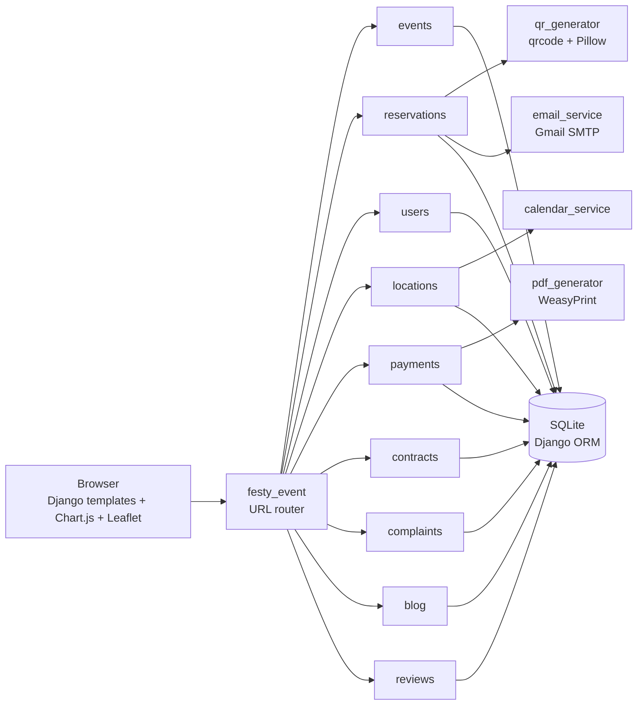

### Reservation flow

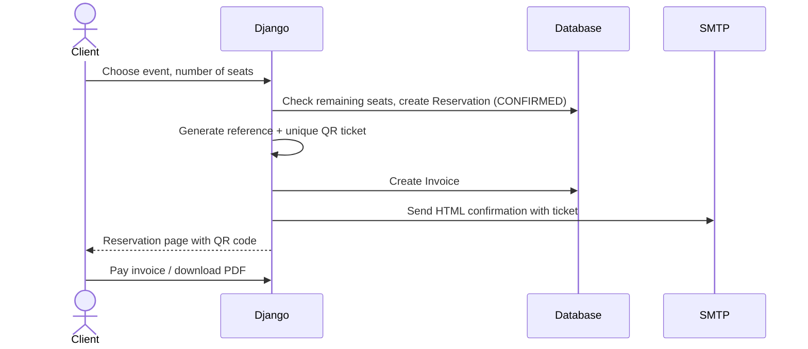

### Data model (main entities)

| App | Models |
|---|---|
| `events` | `Event`, `EventRecommendation`, `RecommendationHelpful` |
| `reservations` | `Reservation` |
| `payments` | `Payment`, `Invoice` |
| `locations` | `Location`, `BlockedDate` |
| `contracts` | `Contract` |
| `complaints` | `Complaint` |
| `blog` | `BlogCategory`, `BlogPost`, `BlogComment`, `Newsletter` |
| `reviews` | `Review`, `ReviewHelpful`, `FAQ`, `ContactMessage` |
| `users` | Django's built-in `User` (`is_staff` = administrator) |

---

## 📸 Screenshots

### Public site

| Events catalog | Event detail |
|---|---|
|  | 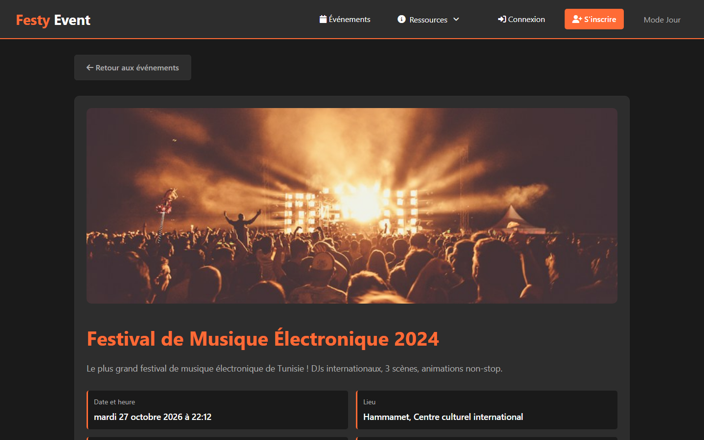 |

| Interactive map of Tunisia | Blog |
|---|---|
| 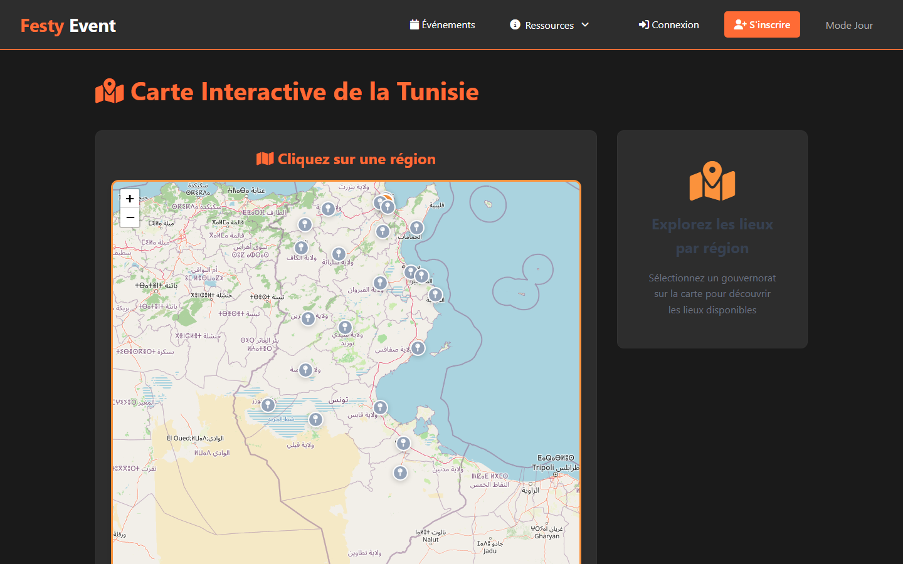 | 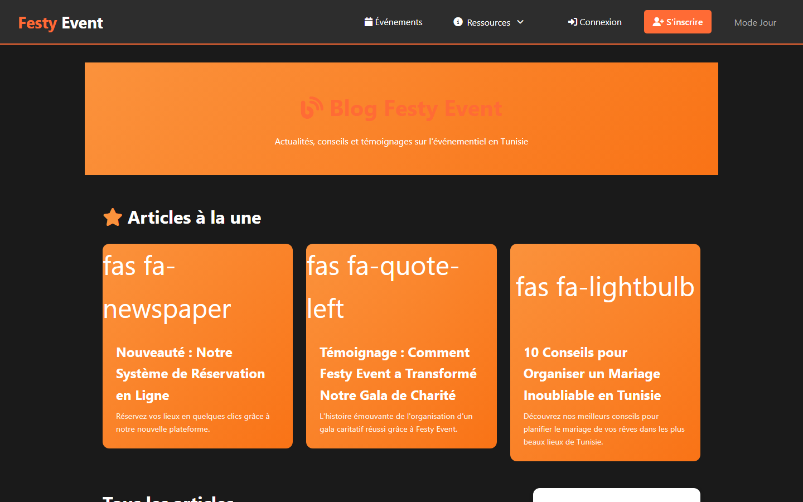 |

| FAQ | Login |
|---|---|
| 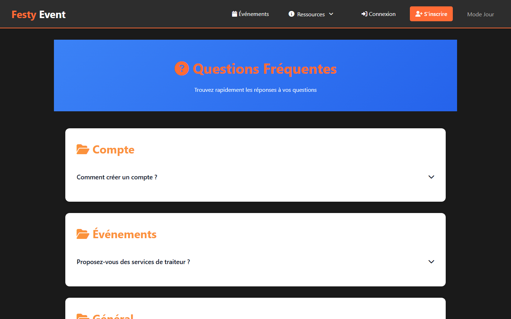 | 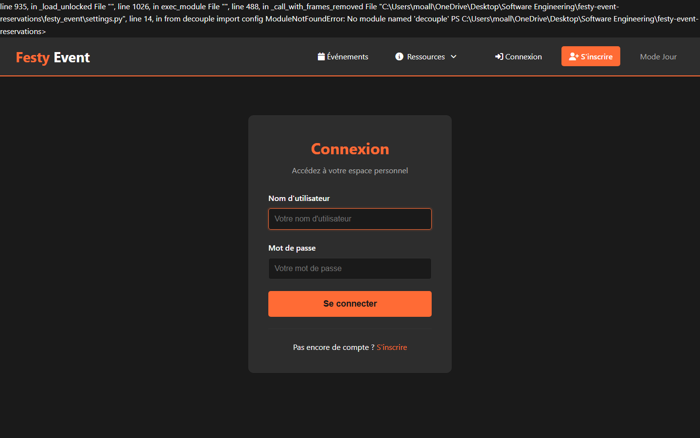 |

### Client space

| Client dashboard | Booking form |
|---|---|
| 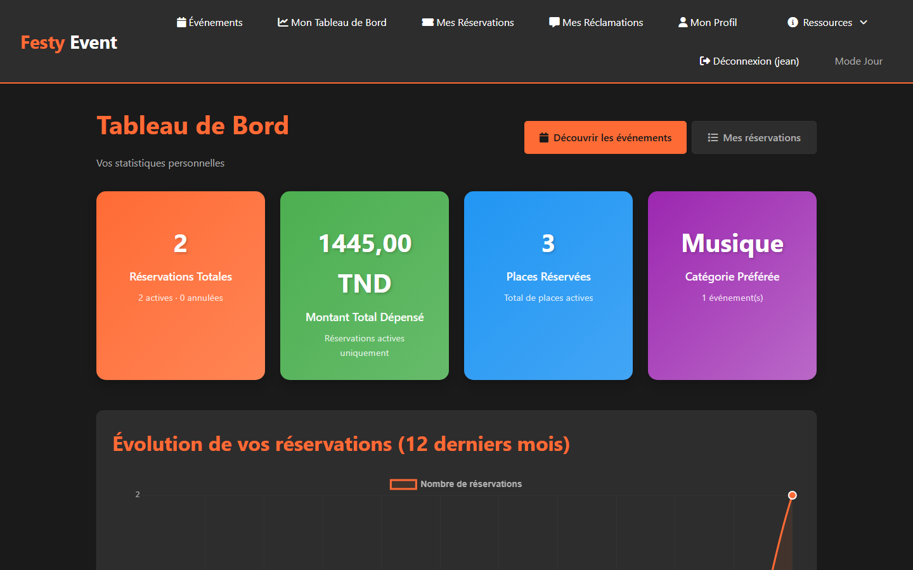 | 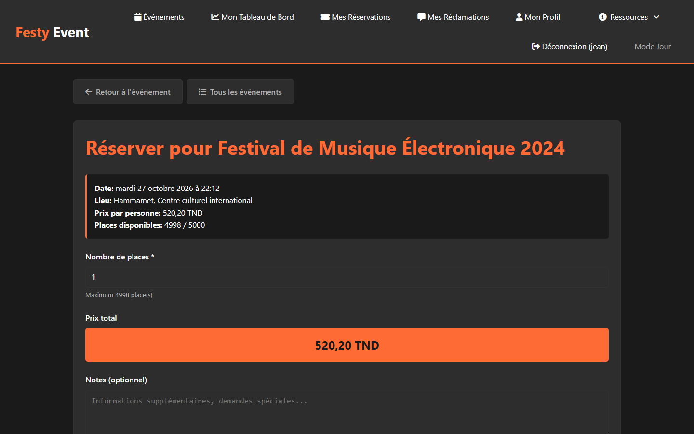 |

| My reservations | QR-code ticket |
|---|---|
| 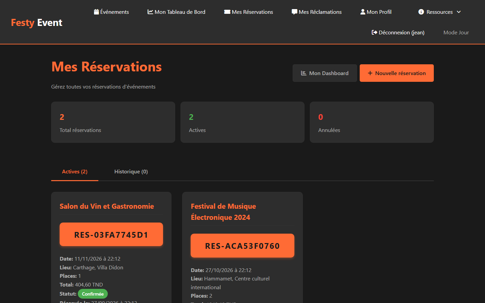 | 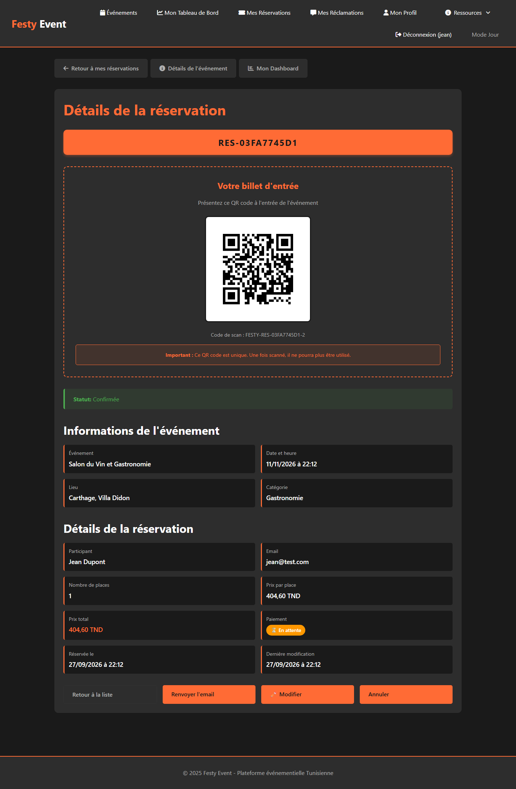 |

### Administration

| Admin dashboard | Analytics |
|---|---|
| 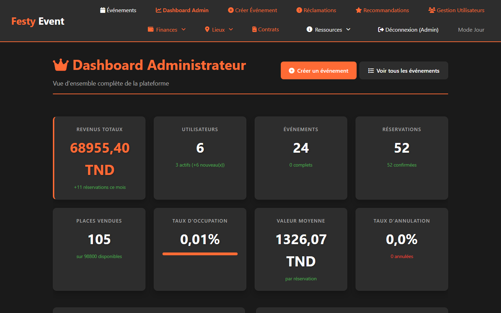 | 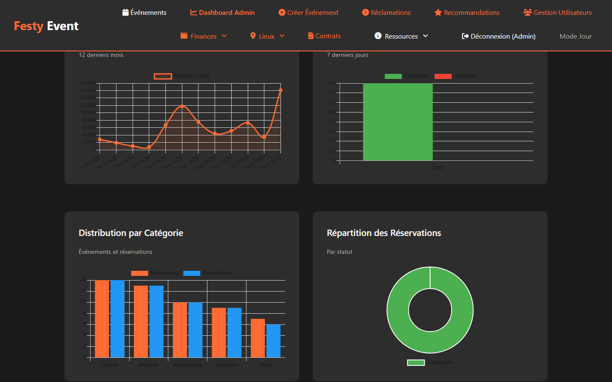 |

| Venues | Venue availability calendar |
|---|---|
| 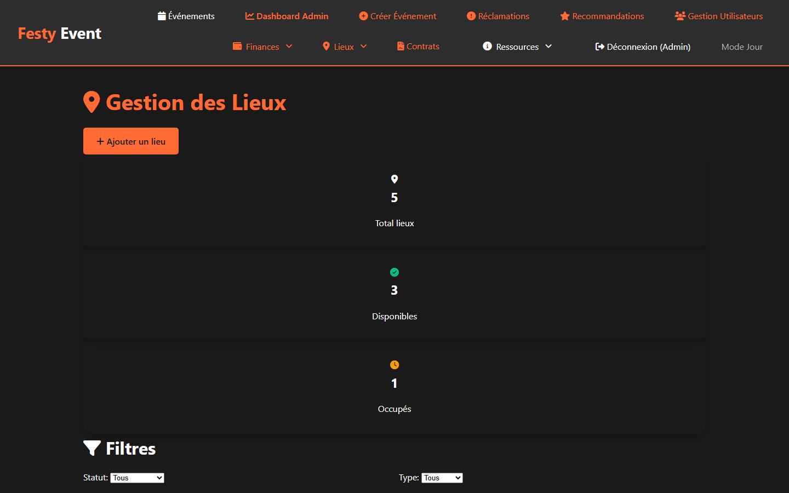 | 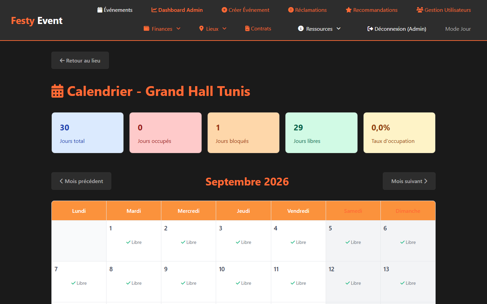 |

---

## 🛠 Tech Stack

| Layer | Technologies |
|---|---|
| Backend | Python 3.13, Django 5.2 (function-based views, ORM, auth, messages) |
| Database | SQLite (development) — swappable through Django `DATABASES` |
| Frontend | Django templates, HTML5, CSS3 (custom dark/light theme), vanilla JavaScript |
| Charts | Chart.js 4 |
| Maps | Leaflet 1.9 + OpenStreetMap tiles |
| Documents | WeasyPrint (PDF invoices), `qrcode` + Pillow (tickets & payment QR) |
| Email | Django SMTP backend (Gmail app password) with HTML templates |
| Config | `python-decouple` (`.env`) |
| Icons | Font Awesome 6 |

---

## 📁 Project Structure

```text
.
├── festy_event/        # project settings, root URLconf, WSGI/ASGI
├── events/             # events + community recommendations
├── reservations/       # bookings, dashboards, QR tickets, confirmation emails
├── users/              # auth, profiles, admin user management
├── locations/          # venues, Tunisia map, availability calendar, blocked dates
├── payments/           # payments, invoices, PDF generation
├── contracts/          # service contracts with dual signature
├── complaints/         # user complaints and admin responses
├── blog/               # posts, categories, comments, newsletter
├── reviews/            # reviews, FAQ, contact messages
├── templates/          # all HTML templates (per app) + email templates
├── static/             # CSS theme and theme-toggle script
├── scripts/            # demo-data seeders and maintenance utilities
├── docs/               # backlog, feature notes, email setup guides, screenshots
├── .env.example        # environment template
├── manage.py
└── requirements.txt
```

---

## ⚙️ Getting Started

### Prerequisites

| Tool | Version | Notes |
|---|---|---|
| Python | 3.11+ (developed on 3.13) | |
| pip / venv | bundled with Python | |
| WeasyPrint system libs | — | only needed for PDF invoices; on Windows install the [GTK runtime](https://doc.courtbouillon.org/weasyprint/stable/first_steps.html) |

### 1. Clone and install

```bash
git clone https://github.com/MelekCreed/Festy-Event.git
cd Festy-Event
python -m venv .venv
# Windows: .venv\Scripts\activate    macOS/Linux: source .venv/bin/activate
pip install -r requirements.txt
```

### 2. Configure

```bash
cp .env.example .env
```

| Variable | Purpose | Default |
|---|---|---|
| `SECRET_KEY` | Django secret key | insecure dev placeholder |
| `DEBUG` | Debug mode | `True` |
| `ALLOWED_HOSTS` | Comma-separated hosts | `localhost,127.0.0.1` |
| `EMAIL_HOST_USER` | Gmail address used to send emails | empty (emails disabled) |
| `EMAIL_HOST_PASSWORD` | Gmail **app password** | empty |
| `EMAIL_RECIPIENT` | Admin notification address | empty |

See [docs/CONFIGURATION_EMAIL.md](docs/CONFIGURATION_EMAIL.md) for the Gmail app-password setup.

### 3. Database and demo data

```bash
python manage.py migrate
python scripts/create_test_data.py          # admin + demo clients + first events
python scripts/create_more_events.py        # full Tunisian event catalog
python scripts/create_full_test_data.py     # venues, payments, invoices, contracts
python scripts/create_blocked_dates.py      # venue calendar blocked dates
python scripts/create_blog_content.py       # blog posts, comments, newsletter
```

The seeders create local **demo** accounts (printed in the console): an administrator `admin` and clients such as `jean` / `marie`. They are for local development only — change or delete them before any real deployment.

### 4. Run

```bash
python manage.py runserver
```

Open http://127.0.0.1:8000 — the root redirects to the events catalog. The Django admin is at `/admin/`.

---

## 🗺 Main Routes

| Path | Description | Access |
|---|---|---|
| `/events/` | Events catalog | Public |
| `/events/<id>/` | Event detail + recommendations | Public |
| `/locations/map/` | Interactive Tunisia map | Public |
| `/blog/`, `/reviews/faq/`, `/reviews/contact/` | Content & support | Public |
| `/users/register/`, `/users/login/` | Authentication | Public |
| `/reservations/create/<event_id>/` | Book an event | Client |
| `/reservations/`, `/reservations/dashboard/` | My bookings, my stats | Client |
| `/invoice/<id>/`, `/invoice/<id>/pdf/` | Invoice view / PDF | Owner |
| `/complaints/` | My complaints | Client |
| `/reservations/admin-dashboard/` | Global KPIs and charts | Admin |
| `/locations/`, `/locations/<id>/calendar/` | Venues and availability | Admin |
| `/payments/`, `/invoices/` | Financial supervision | Admin |
| `/contracts/` | Contract management & signature | Admin |
| `/users/admin/users/` | User management | Admin |
| `/complaints/admin/list/` | Complaint handling | Admin |
| `/events/admin/recommendations/` | Recommendation moderation | Admin |

The complete URL map is documented in [docs/GUIDE_URLS_COMPLETE.md](docs/GUIDE_URLS_COMPLETE.md).

---

## 📚 Additional Documentation

| Document | Content |
|---|---|
| [docs/BACKLOG_RESERVATIONS.txt](docs/BACKLOG_RESERVATIONS.txt) | Product backlog and user stories |
| [docs/PROJECT_COMPLETE_SUMMARY.md](docs/PROJECT_COMPLETE_SUMMARY.md) | Module-by-module functional summary |
| [docs/FONCTIONNALITES_AVANCEES.md](docs/FONCTIONNALITES_AVANCEES.md) | Advanced features (PDF, statistics, …) |
| [docs/NOUVELLES_FONCTIONNALITES.md](docs/NOUVELLES_FONCTIONNALITES.md) | Map, calendar and blocked dates |
| [docs/US4_5_7_BACKEND_COMPLETE.md](docs/US4_5_7_BACKEND_COMPLETE.md), [docs/US6_COMPLETE.md](docs/US6_COMPLETE.md) | Payments, venues, contracts and complaints backend notes |
| [docs/GUIDE_TEST_EMAIL.md](docs/GUIDE_TEST_EMAIL.md) | Testing the confirmation email |

---

## 🔐 Security Notes

- No secrets are stored in the repository: `SECRET_KEY` and SMTP credentials come from `.env` (ignored by git).
- The previous hard-coded development `SECRET_KEY` was removed; generate a new one for any deployment.
- `db.sqlite3`, media uploads and virtual environments are git-ignored.
- Before production: set `DEBUG=False`, a strong `SECRET_KEY`, real `ALLOWED_HOSTS`, a production database (e.g. PostgreSQL) and `collectstatic`.

---

## 🧭 Roadmap

- [ ] Automated test suite (unit tests for models and booking rules)
- [ ] Online payment gateway integration (currently simulated payment flow)
- [ ] QR ticket scanning endpoint for event check-in
- [ ] PostgreSQL + Docker setup for deployment
- [ ] English translation (Django i18n)

---

## 👤 Author

**Melek Moalla** — [@MelekCreed](https://github.com/MelekCreed)
